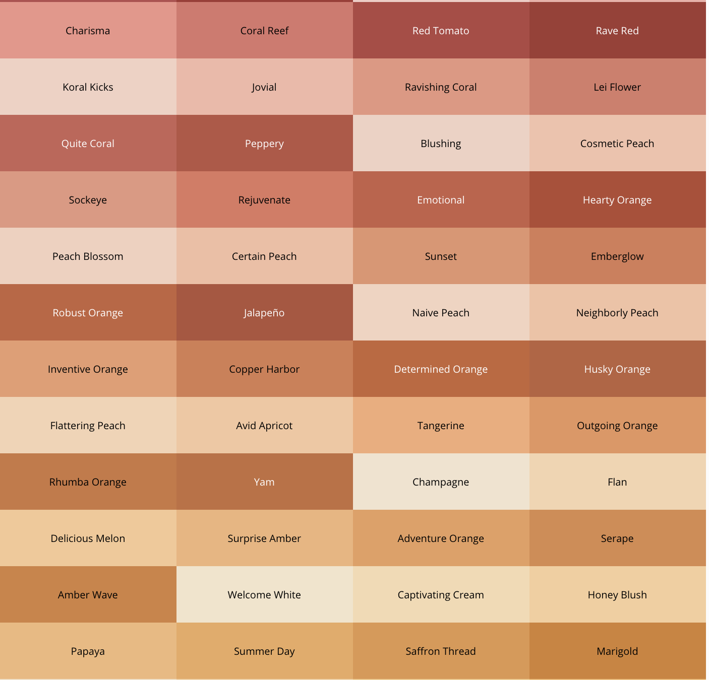

# sherwin-williams

### Installation

```
npm install sherwin-williams
-- or
yarn add sherwin-williams
```

### Usage

Import the CSS variables.

```jsx
import "sherwin-williams/sherwin-williams.css";
```

Or import the colors as an array.

```jsx
import sherwinWilliams from "sherwin-williams/";
```

View the [list of available variables here](./sherwin-william.css).


_And many more!_
